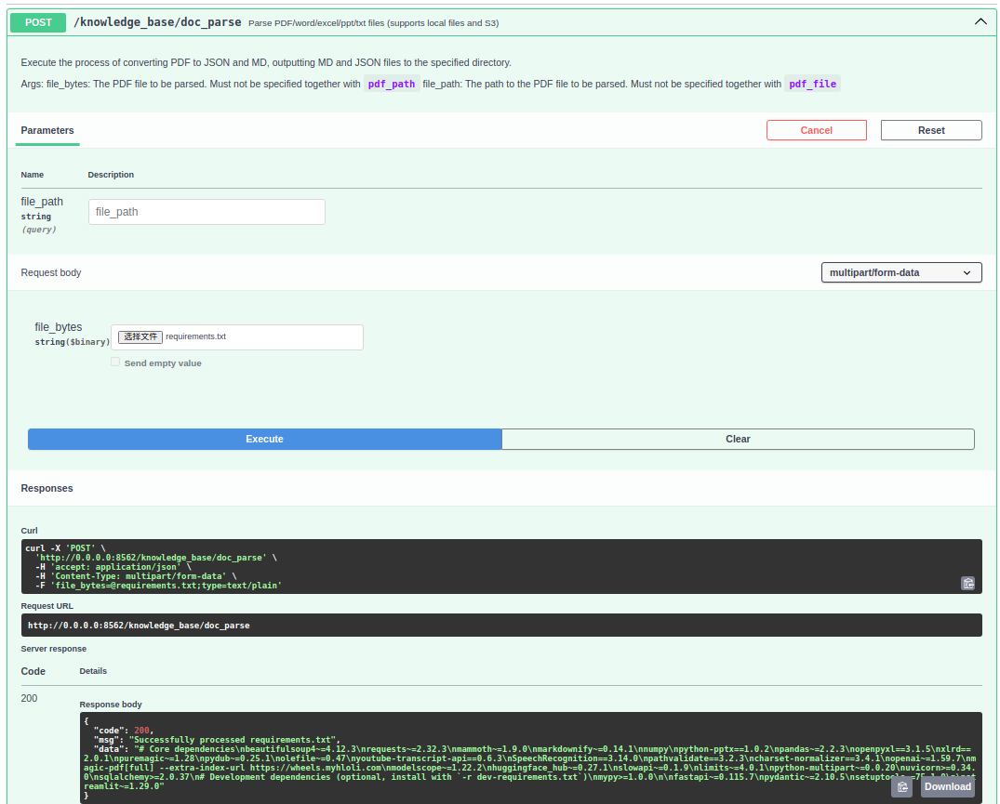

# Markify

## 📢 News

+ 【2025.04.11】 V1.0版本，基于 Markitdown 与 MinerU**，支持多种格式转换，并提供 **高质量 PDF 解析**，让你的文档更易处理、更易用！  

## 🙌  简介

✨ **轻松转换文件为 Markdown，助力 RAG 与 LLM 更智能地理解内容！** ✨

📡 **支持 API & Streamlit 端**，随时随地高效转换，轻松集成！  

📂 **支持多种文件格式**：
- 📄 **文档**：PDF、Word、PPT、Excel  
- 🖼 **多媒体**：图片、音频  
- 🌐 **网页与数据**：HTML、CSV、JSON、XML  
- 🗂 **压缩文件**：ZIP  

⚡ **多种解析模式，满足不同需求**：
- 🚀 **快速模式**（其他格式基于 Markitdown，解析高效）  
- 🏆 **高级模式**（针对PDF采用 MinerU 深度解析，效果更佳）  

## 🐳 镜像地址

> 阿里云地址：docker pull registry.cn-beijing.aliyuncs.com/quincyqiang/mineru:0.1-models


## 🤖 使用方式

按照以下命令启动项目

```shell
下载模型
python models/download_models.py
修改模型路径
vim magic-pdf.json
python startup.py
```

### api接口

```
http://localhost:8562/docs
http://127.0.0.1:8562/docs
```

### 修改文件限制

```
base_config.MAX_PAGES = 50
base_config.MIN_CTX = 100
base_config.MAX_CTX = 20000
base_config.MAX_SIZE = 50  # 最大文件大小20m
```


## 截图





## TODO
- 全部文件格式走mineru
- 自动打包为Docker镜像


## 致敬
本项目参考微软markitdown和上海浦语mineru。
- [markitdown](https://github.com/microsoft/markitdown)
- [mineru](https://github.com/opendatalab/MinerU)
